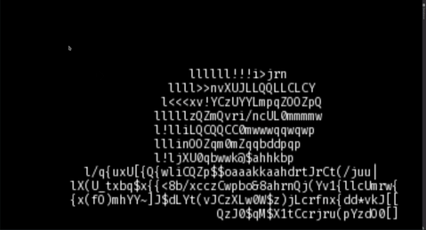

- 👋 Hi, I’m Henry Nguyen
- 👀 I’m interested in databases, graphics, public transit, and maps
- 🌱 I’m currently learning about Rust and DNS
- 💞️ I’m looking to collaborate on any cool project
- 📫 How to reach me: email h99nguye at uwaterloo.ca

### Here are some of my projects:

[**Interactive travel time map**](https://map.henryn.xyz) - An interactive travel time map that shows you how far you can go using public transit. 

[**3d renderer**](https://3d-renderer.netlify.app) - An image buffer, triangle rasterizer, 3d renderer from scratch. Includes shadows, highlights, ambient lighting, and various performance optimizations. Compiled to WASM.

[**Custom DNS Nameserver**](https://github.com/econaxis/dns) - Authorative DNS nameserver (based off RFC 1034/1035) from scratch.

[**JSON database**](https://github.com/econaxis/database) - A fully transactional, ACID database that can store infinite depth JSON objects. Primitive support for replicated transactions using gRPC. 

[**db1**](https://github.com/econaxis/db1) - A second iteration attempt to make a database. A simpler key-value database with static schema, fixed-size tuples, and columnar compression. Built for use by my search engine

[**Full-text search engine**](https://github.com/econaxis/search) - A full-text search engine (like Elasticsearch). Demo includes near-instant textual search of all English Wikibooks articles. Uses *db1* as the underlying storage engine

[**Automatic ATC with A\* pathfinding**](https://github.com/econaxis/atc/) - Routes incoming airplanes to one of two runways while avoiding collisions. Done for a coding assignment. 

[**Beeeeeep**](https://github.com/econaxis/beeeeeep) - Experiments with audio processing and modulation to send and receive binary data over audio at 1kbps. 

[**Bridge Static Analysis**](https://github.com/econaxis/struss) - Solves forces on bridges and uses random search to minimize cost of bridge.

*([longer video here](https://youtu.be/sEx_jOtT0IM))*
[**Transit map**](https://github.com/econaxis/transit) - 
Map visualization of 1000+ Toronto buses travelling in real-time. Uses WebGL and some performance optimizations to do 60FPS rendering of that many buses.
Source of the topmost GIF.
For a better video than the GIF, I have a [Youtube video](https://youtu.be/sEx_jOtT0IM)

[**Coroutines and garbage collector in C**](https://github.com/econaxis/coroutines) - 
Userspace context switching, multitasking without threads, or stackful, preemptive multitasking. Implemented with some small inline assembly and register manipulation. Made a fair task scheduler based off the Linux CFS scheduling algorithm.
Mark-and-sweep garbage collector in C. Implemented using `pycparser` to modify C code, and custom stack frames to find GC roots. 

[**Interactive ontology visualization**](https://github.com/climateMind/climatemind-ontology-visualization) -
Interactive knowledge graph visualization built using Cytoscape.JS and Python backend. Generated Docker images for easy deployment. 

[**Othello game with AI**](https://github.com/econaxis/othello) -
An othello game made for my university class. Implemented a minimax AI algorithm with culling. 

<!---
econaxis/econaxis is a ✨ special ✨ repository because its `README.md` (this file) appears on your GitHub profile.
You can click the Preview link to take a look at your changes.
--->
